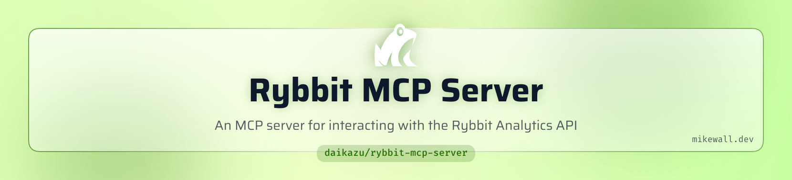

<picture>
   <source media="(prefers-color-scheme: dark)" srcset="art/header-dark.png">
   
</picture>

# Rybbit MCP Server

An MCP (Model Context Protocol) server for interacting with the [Rybbit Analytics](https://rybbit.com) API. This server provides tools for querying analytics data, managing sites, tracking events, and more.

## Installation

```bash
npm install
```

## Configuration

### Environment Variables

| Variable | Required | Default | Description |
|----------|----------|---------|-------------|
| `RYBBIT_API_KEY` | Yes | — | Your Rybbit API key |
| `RYBBIT_URL` | No | `https://app.rybbit.io` | Base URL for the Rybbit API (for self-hosted instances) |

### Getting an API Key

1. Navigate to Settings → Account in your Rybbit dashboard
2. Go to the API Keys section
3. Create a key with a custom name
4. Copy it immediately (it won't be shown again)

## Usage

### With Claude Desktop

Add to your Claude Desktop configuration (`~/Library/Application Support/Claude/claude_desktop_config.json` on macOS):

```json
{
  "mcpServers": {
    "rybbit": {
      "command": "node",
      "args": ["/path/to/rybbit-mcp-server/src/index.js"],
      "env": {
        "RYBBIT_API_KEY": "your_api_key_here"
      }
    }
  }
}
```

For self-hosted Rybbit instances, add the `RYBBIT_URL` environment variable:

```json
{
  "mcpServers": {
    "rybbit": {
      "command": "node",
      "args": ["/path/to/rybbit-mcp-server/src/index.js"],
      "env": {
        "RYBBIT_API_KEY": "your_api_key_here",
        "RYBBIT_URL": "https://your-rybbit-instance.com"
      }
    }
  }
}
```

### With Claude Code

Add to your Claude Code MCP settings (`~/.claude/settings.json`):

```json
{
  "mcpServers": {
    "rybbit": {
      "command": "node",
      "args": ["/path/to/rybbit-mcp-server/src/index.js"],
      "env": {
        "RYBBIT_API_KEY": "your_api_key_here",
        "RYBBIT_URL": "https://your-rybbit-instance.com"
      }
    }
  }
}
```

### Standalone

```bash
RYBBIT_API_KEY=your_api_key npm start

# For self-hosted instances:
RYBBIT_API_KEY=your_api_key RYBBIT_URL=https://your-instance.com npm start
```

## Available Tools

### Overview & Metrics
- `rybbit_get_overview` - Get high-level analytics (sessions, pageviews, users, bounce rate)
- `rybbit_get_overview_timeseries` - Get time-series analytics data
- `rybbit_get_metric` - Get dimensional breakdown by parameter (browser, country, etc.)
- `rybbit_get_live_visitors` - Get count of currently active visitors

### Sessions
- `rybbit_get_sessions` - Get paginated list of sessions
- `rybbit_get_session_details` - Get detailed session info with events
- `rybbit_get_session_locations` - Get session locations for map visualization

### Events
- `rybbit_get_events` - Get paginated list of events
- `rybbit_get_event_names` - Get unique event names with counts
- `rybbit_get_event_properties` - Get properties for a specific event
- `rybbit_get_outbound_links` - Get outbound link clicks

### Users
- `rybbit_get_users` - Get paginated list of users
- `rybbit_get_user_sessions` - Get sessions for a specific user
- `rybbit_get_user_session_count` - Get daily session count for a user
- `rybbit_get_user_info` - Get detailed user profile

### Goals
- `rybbit_get_goals` - Get goals with conversion metrics
- `rybbit_get_goal_sessions` - Get sessions that completed a goal
- `rybbit_create_goal` - Create a new goal (path or event-based)
- `rybbit_update_goal` - Update goal configuration
- `rybbit_delete_goal` - Delete a goal

### Funnels
- `rybbit_get_funnels` - Get saved funnels
- `rybbit_analyze_funnel` - Analyze step-by-step conversion
- `rybbit_get_funnel_step_sessions` - Get sessions at a funnel step
- `rybbit_create_funnel` - Create a new funnel
- `rybbit_delete_funnel` - Delete a funnel

### Performance (Core Web Vitals)
- `rybbit_get_performance_overview` - Get LCP, CLS, INP, FCP, TTFB metrics
- `rybbit_get_performance_timeseries` - Get performance trends over time
- `rybbit_get_performance_by_dimension` - Get performance by pathname, country, etc.

### Error Tracking
- `rybbit_get_error_names` - Get unique errors with counts
- `rybbit_get_error_events` - Get error occurrences with stack traces
- `rybbit_get_error_timeseries` - Get error trends over time

### Retention & Journeys
- `rybbit_get_retention` - Get cohort-based retention analysis
- `rybbit_get_journeys` - Get common user navigation paths

### Organizations & Sites
- `rybbit_get_organizations` - Get your organizations
- `rybbit_get_organization_members` - Get organization members
- `rybbit_add_organization_member` - Add a member to an organization
- `rybbit_create_site` - Create a new site
- `rybbit_get_site` - Get site details
- `rybbit_update_site` - Update site configuration
- `rybbit_delete_site` - Delete a site

### Event Tracking
- `rybbit_track_event` - Send tracking events (pageview, custom, performance, error, outbound)

## Common Parameters

### Time Parameters
Most analytics tools accept time parameters:
- `startDate` / `endDate` - Date range in YYYY-MM-DD format
- `timeZone` - IANA timezone (e.g., "America/New_York")
- `pastMinutesStart` / `pastMinutesEnd` - Relative time range in minutes

### Filters
Filter data using JSON array format:
```json
[
  {
    "parameter": "country",
    "type": "equals",
    "value": ["US"]
  }
]
```

Filter types: `equals`, `not_equals`, `contains`, `not_contains`, `regex`, `not_regex`, `greater_than`, `less_than`

Available parameters: `browser`, `operating_system`, `device_type`, `country`, `region`, `city`, `pathname`, `page_title`, `hostname`, `querystring`, `referrer`, `utm_source`, `utm_medium`, `utm_campaign`, `user_id`, `event_name`

## Rate Limits

The Rybbit API has a rate limit of 500 requests per 10 minutes per API key.

## License

MIT
